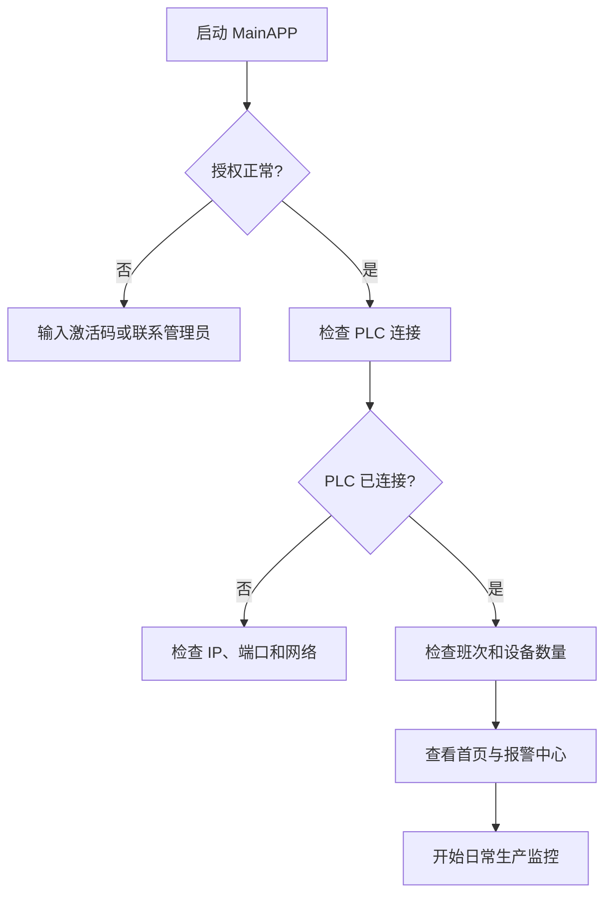

# MainAPP 用户使用手册

> 面向第一次使用 Kanban 工业看板的操作员、班组长和现场管理员。
>
> 本手册尽量用“照着做”的方式说明操作。看到蓝色按钮就点击，看到红色状态先处理报警，不需要了解程序代码也可以完成日常工作。

## 1. 这套系统能做什么

MainAPP 用来集中查看和管理生产现场信息：

- 查看设备当前状态：运行、暂停、报警、空闲、离线。
- 查看总产量、良品数、不良数、生产速度和 OEE 指标。
- 查看实时报警、报警发生记录和恢复记录。
- 查询生产、状态转换和报警历史。
- 管理设备、PLC 地址、报警点、缺陷点和计数报警。
- 创建和跟踪生产工单。
- 查看 PLC 连接、采集周期、历史存储和电脑资源状态。
- 管理授权、班次、刷新频率和界面显示设置。

## 2. 第一次使用前

### 2.1 使用前检查清单

第一次启动前，请让设备管理员确认：

- 电脑已经连接到 PLC 所在的网络。
- 已知 PLC 的 IP 地址和端口。
- 已准备好设备名称和各个 PLC 地址。
- 已确认当前班次的开始时间和结束时间。
- 已确认当前用户有修改设备和 PLC 配置的权限。
- 已完成授权或仍在试用期内。

> 不要在没有确认地址的情况下填写或点击“复位产量”。写入 PLC 的命令可能影响现场生产。

### 2.2 启动程序

1. 双击 `MainAPP.exe`，或使用管理员提供的桌面快捷方式。
2. 等待主窗口出现。
3. 如果出现授权窗口，按照“授权管理”章节处理。
4. 首次启动建议先打开“设置”，确认 PLC 和班次信息，再进入设备管理。

程序默认以大屏模式打开。如果窗口比例不是 16:9，画面可能在左右或上下留出空白，这是为了保证内容不被裁切。

## 3. 认识主界面

主界面左侧是导航栏，右侧是当前页面。点击导航栏图标可以切换页面；鼠标移动到图标上会显示提示文字。

上图是首页示例。截图中的设备数量、产量、报警和时间均为示例数据，现场运行时会随 PLC 采集结果变化。

### 3.1 导航栏常用页面

| 图标含义 | 页面 | 用途 |
| --- | --- | --- |
| 四格方块 | 首页 | 快速查看整条生产线的核心指标 |
| 工厂/产线 | 产线 | 按产线或设备布局查看生产状态 |
| 铃铛 | 报警中心 | 处理当前报警和查询报警统计 |
| 设备 | 设备管理 | 配置设备、地址、报警和缺陷 |
| 时钟 | 历史查询 | 查询生产、报警和状态历史 |
| 折线图 | 生产复盘 | 查看趋势、产量和 OEE 汇总 |
| 齿轮 | 设置 | 配置 PLC、班次、刷新和授权 |
| 工单 | 工单管理 | 创建、分配和跟踪生产工单 |
| 监控 | 运行监控 | 检查采集服务和系统资源 |

### 3.2 PLC 状态怎么看

左侧导航栏底部有“PLC 连接”状态：

- **绿色圆点**：PLC 已连接，系统可以继续采集。
- **红色圆点**：PLC 未连接或最近连接失败，需要检查网络和设置。
- **断线次数**：表示本次运行期间累计断线次数，不是报警数量。

如果 PLC 未连接，首页上的设备状态和产量不会继续更新。先查看“设置”和“运行监控”，不要反复点击复位命令。

## 4. 日常开机操作

每天开机建议按下面顺序进行：

1. 打开程序，等待页面加载完成。
2. 看左下角 PLC 状态是否为绿色。
3. 打开“运行监控”，确认采集服务正在运行。
4. 打开“报警中心”，确认没有未处理的高等级报警。
5. 返回“首页”，确认设备数量和生产指标符合现场情况。

## 5. 首页：看懂生产情况

首页适合快速浏览，不建议在首页直接修改设备配置。重点看以下内容：

### 5.1 设备状态

设备卡片通常会显示设备名称、当前状态、当前产量或运行信息：

- **运行**：设备正在生产。
- **暂停**：设备暂时停止，但不一定是故障。
- **报警**：设备存在需要处理的报警。
- **空闲**：设备已连接，但当前没有生产动作。
- **离线**：系统无法获得设备的有效数据。

### 5.2 当前生产状态

首页的当前生产状态通常包括：

- 当前速度：当前生产速度。
- 总产量：当前查询范围内的总生产数量。
- 不良数：当前查询范围内的不良数量。
- 目标节拍：设备或产品的目标生产节拍。
- 实际节拍：根据采集数据计算的实际节拍。

看指标时要同时确认查询日期和班次。跨班次或跨天比较时，不能只看一个数字下结论。

### 5.3 首页刷新

首页会自动刷新。如果数据明显长时间不变：

1. 看 PLC 连接是否为绿色。
2. 打开运行监控确认“采集服务运行中”。
3. 检查“最后成功采集时间”。
4. 必要时返回首页或点击页面中的刷新按钮。
5. 仍无数据时联系设备管理员，不要自行删除数据库文件。

## 6. 产线页面：查看整条线

打开左侧的产线图标，可以按产线布局查看多台设备。

建议使用方式：

1. 先看整条产线是否存在红色报警或离线设备。
2. 再按设备名称定位异常设备。
3. 点击设备进入详细信息或跳转设备管理。
4. 处理现场问题后，等待下一轮采集确认状态恢复。

产线页面适合班组长巡检；需要查询具体历史数据时，应使用历史查询页面。

## 7. 报警中心：发现报警后的正确处理方式

报警中心显示当前活跃报警、今日触发次数、今日恢复次数和最近事件。

### 7.1 处理一条报警

1. 点击左侧导航栏的铃铛图标。
2. 查看“实时活跃报警”列表。
3. 先处理高等级报警，再处理低等级报警。
4. 根据报警名称和设备名称到现场确认原因。
5. 处理现场故障后，等待 PLC 信号恢复。
6. 确认报警从活跃列表消失或状态变为已恢复。
7. 如需追溯，进入历史查询查看发生和恢复时间。

### 7.2 报警颜色和状态

- **红色**：需要优先关注的报警或严重状态。
- **黄色**：需要注意或等待处理的状态。
- **绿色/已恢复**：报警条件已经消失，但历史记录仍会保留。
- **活跃报警数量为 0**：当前没有活跃报警，不代表今天没有发生过报警。

### 7.3 报警一直不消失怎么办

按顺序检查：

1. 现场设备是否真的恢复。
2. PLC 连接是否正常。
3. 报警地址是否配置正确。
4. 设备管理中的报警点是否启用。
5. 报警是否属于需要人工确认的现场条件。

报警中心和首页默认使用视觉提醒；如果现场电脑开启了声音，新的报警还会播放本机提示音。声音可在“设置 → 显示设置”中关闭，关闭声音不会关闭报警记录或视觉提醒。

不要直接删除报警记录。删除记录会影响追溯和统计。

## 8. 设备管理：添加和配置设备

设备管理页面分为设备列表和设备详情两部分。左侧选择设备，右侧编辑配置。

### 8.1 添加设备的准备信息

添加设备前准备以下信息：

| 信息 | 示例 | 说明 |
| --- | --- | --- |
| 设备名称 | 注塑机 1 | 页面上显示的名称 |
| OK 计数地址 | D100 | 良品计数器地址 |
| NG 计数地址 | D110 | 不良品计数器地址 |
| 状态地址 | D120 | 设备状态或状态计数地址 |
| 复位地址 | M100 | 班次切换时使用的复位地址 |
| 报警地址 | M200 | 一个报警点对应一个 PLC 位地址 |
| 缺陷地址 | D300 | 缺陷或不良类型对应的计数地址 |

实际地址必须以现场 PLC 程序和设备管理员提供的地址表为准。

### 8.2 添加设备

1. 进入“设备管理”。
2. 点击“新增设备”或页面上的新增按钮。
3. 填写设备名称。
4. 填写 OK、NG、状态和复位地址。
5. 在报警、缺陷或计数报警标签页中添加需要监控的项目。
6. 检查地址是否重复、是否为空、格式是否正确。
7. 点击保存。
8. 返回设备列表，确认设备出现。
9. 等待一次采集周期，确认设备状态和数据开始变化。

### 8.3 修改设备

1. 在左侧设备列表中点击目标设备。
2. 修改需要调整的字段。
3. 点击保存。
4. 如果修改了 PLC 地址，必须观察一次采集结果。
5. 如果修改了设备名称，检查首页、报警中心和历史查询中的显示是否符合预期。

### 8.4 删除设备前的注意事项

删除设备前必须确认：

- 设备已经停止采集或不再使用。
- 不需要继续查询该设备的历史数据。
- 已备份设备配置。

删除设备配置不等于删除历史数据库记录。历史数据是否保留应由管理员按现场数据管理制度决定。

## 9. 历史查询：查生产、报警和状态

打开时钟图标进入历史查询。

### 9.1 查询步骤

1. 选择查询类型：生产、报警或状态转换。
2. 选择开始时间和结束时间。
3. 选择设备；不选择设备时通常表示查询全部设备。
4. 如有需要，选择班次。
5. 点击查询。
6. 检查结果总数和时间范围。
7. 需要留档时使用导出功能生成文件。

### 9.2 查询没有结果怎么办

- 检查开始时间和结束时间是否选反。
- 检查是否选中了错误设备。
- 检查班次名称是否正确。
- 确认该时间段程序确实运行并成功采集。
- 打开运行监控查看历史写入和采集诊断。

不要因为查询为空就立即判断“现场没有生产”，先确认筛选条件和采集状态。

### 9.3 生产复盘与报表导出

打开“生产复盘”可以按当前班次、上一班次、今日、近 24 小时或近 7 天查看汇总。页面包含总产量、良品率、OEE、报警、设备明细、班次对比和 Top 报警。

1. 选择统计时间范围。
2. 点击刷新，等待数据加载完成。
3. 检查数据覆盖提示，确认产量、状态和报警数据是否完整。
4. 点击“导出报表”，选择保存位置。
5. 用导出的 CSV 文件留存班次或日报结果。
6. 需要正式归档或打印时，点击“导出 PDF”，选择保存位置。

PDF 报表包含统计范围、核心 KPI、设备明细、班次对比和 Top 报警。PDF 使用本机中文字体生成；如果系统缺少中文字体，程序会提示导出失败，不会生成残缺文件。

## 10. 工单管理

打开工单图标进入工单管理。

常用流程：

1. 点击新增工单。
2. 填写工单号、产品、目标数量、设备和计划时间。
3. 保存工单。
4. 按现场流程将工单设置为待开始、进行中、已完成或取消。
5. 生产过程中通过首页和历史查询核对实际产量。
6. 工单完成后检查目标数量和实际数量差异。

工单名称和产品名称请使用现场统一命名，不要同一个产品使用多个写法，否则后续统计容易分散。

工单列表默认按计划开始时间排序。可以切换按计划结束时间、状态或创建时间排序；列表中的“计划冲突”表示同一设备的待开始/进行中工单时间有重叠，需要先调整计划再启动工单。

## 11. 设置：PLC、班次和显示

### 11.1 PLC 连接配置

在设置页的“PLC 连接配置”中填写：

- **IP 地址**：PLC 的局域网地址，例如 `192.168.1.10`。
- **端口**：由现场 PLC 通信配置确定，示例中常见为 `4999`。
- **轮询间隔**：系统读取设备的时间间隔，单位为毫秒。
- **历史写入间隔**：每多少次扫描写入一次历史快照。
- **主页刷新间隔**：首页显示刷新间隔。

修改后：

1. 检查数字没有填成 0 或负数。
2. 点击保存。
3. 等待连接状态更新。
4. 打开运行监控确认采集周期正常。

轮询间隔过小可能增加 PLC 和电脑负载；历史写入过于频繁可能增加数据库写入压力。没有明确需求时不要随意调整。

### 11.2 班次配置

班次用于统计产量、报警和 OEE 时间：

1. 在设置页找到班次配置。
2. 填写班次名称。
3. 设置开始和结束时间。
4. 跨午夜班次要确认结束时间属于第二天的逻辑范围。
5. 保存后，等到下一次采集或重新启动验证。

班次名称一旦用于历史统计，建议不要频繁修改。

### 11.3 界面显示设置

设置页可能包含：

- 暗色主题。
- 界面字号缩放。
- 首页刷新间隔。
- 新报警声音开关。
- 其他显示偏好。

大屏距离较远时可以提高字号缩放；普通办公显示器建议先使用默认值。

## 12. 授权管理

设置页顶部显示授权状态：

- **试用期内**：显示剩余试用天数。
- **已激活**：显示授权类型和有效期。
- **已过期或异常**：需要输入新的激活码或联系管理员。

激活步骤：

1. 记录页面显示的机器码。
2. 将机器码提供给授权管理员。
3. 获取对应激活码。
4. 在激活窗口输入激活码。
5. 点击激活。
6. 看到“已激活”后重新检查程序功能。

激活码通常与机器绑定，不要将其他电脑的激活码直接复制使用。

## 13. 运行监控：判断系统是否健康

打开监控图标查看系统运行诊断。重点关注：

| 项目 | 正常表现 | 异常表现 |
| --- | --- | --- |
| PLC 连接 | 已连接 | 未连接、反复重连 |
| 采集服务 | 正在运行 | 已停止 |
| 最近成功设备数 | 大于 0 或当前确实无设备 | 长时间为 0 |
| 最近采集时间 | 持续更新 | 长时间不变 |
| 连续失败周期 | 0 或偶尔增加 | 持续增加 |
| 历史写入 | 数据库正常 | 写入错误或磁盘不足 |
| 系统资源 | 内存和磁盘充足 | 内存高、磁盘接近满 |

判断“系统故障”时，至少同时检查 PLC 状态、最近成功采集时间和连续失败周期三个指标。

## 14. 常见问题

### Q1：打开后 PLC 一直未连接

1. 检查网线和交换机。
2. 在 Windows 中确认电脑可以访问 PLC IP。
3. 检查设置页 IP 和端口。
4. 确认 PLC 允许当前电脑连接。
5. 查看运行监控和日志。

### Q2：首页产量不增加

1. 确认设备正在生产。
2. 确认 PLC 已连接。
3. 确认 OK/NG 地址没有填错。
4. 确认设备没有处于班次清零窗口。
5. 检查最近成功采集设备数。

### Q3：设备显示离线，但 PLC 是绿色

PLC 绿色只表示 PLC 连接正常，不代表每台设备地址都正确。请检查该设备的地址配置和采集结果。

### Q4：报警中心没有报警，但现场设备报警

检查报警点是否已添加、启用，并确认报警 PLC 地址正确。现场报警信号和系统报警点不是自动匹配的。

### Q5：历史查询没有数据

检查查询时间、设备、班次和历史写入状态。刚发生的数据可能还没有到达下一次历史写入周期。

### Q6：保存后配置似乎没有生效

确认是否点击了保存，并重新打开页面检查。若仍无效，检查配置目录是否有写入权限，以及是否生成了 `.corrupt` 文件。

### Q7：程序无法启动或启动后退出

请保留以下信息并联系管理员：

- 出现的完整提示文字。
- 发生时间。
- 是否刚修改过配置。
- 是否刚更换过 PLC 或电脑网络。
- `%APPDATA%\Kanban` 下最近的日志文件。

不要直接删除配置和数据库文件。删除前先备份整个数据目录。

## 15. 日常关机

1. 确认没有正在执行的生产复位或配置保存操作。
2. 确认工单状态已按现场要求更新。
3. 关闭 MainAPP 窗口。
4. 等待程序退出完成，不要立即强制结束进程。
5. 如需备份，复制整个 `%APPDATA%\Kanban` 目录。

## 16. 新手最重要的三条规则

1. **先看 PLC 连接，再判断数据是否异常。**
2. **先确认地址表，再修改设备配置或执行写入命令。**
3. **先备份数据目录，再删除设备、修改班次或处理配置损坏。**

---

## 附录：给管理员的快速信息

- 主应用项目文件：[MainAPP.csproj](../MainAPP.csproj)
- 主应用技术说明：[MainAPP README](../README.md)
- 仓库总览：[根目录 README](../../README.md)
- 建议测试：`MainAPP.Tests`、`MainAPP.E2E`、`MainAPP.UIAutomation`
- 默认数据根目录：`%APPDATA%\Kanban`
- 可选数据根目录环境变量：`KANBAN_DATA_DIR`
